# Audio Engine Flowchart

This document contains flowcharts showing the architecture and data flow of the audio engine.

## 🎯 Main System Architecture

```mermaid
flowchart TB
    subgraph Application["Application Layer"]
        User["User Code<br/>(main.c)"]
        Callbacks["Hardware Callbacks<br/>• ReadVolume()<br/>• DAC_MasterSwitch()<br/>• MX_I2S2_Init()"]
    end

    subgraph Engine["Audio Engine Core"]
        Init["AudioEngine_Init()"]
        Play["PlaySample()"]
        Control["Playback Control<br/>• Pause/Resume<br/>• WaitForEnd"]
        Config["Filter Configuration<br/>• SetFilterConfig()<br/>• SetLpf16BitLevel()<br/>• SetAirEffectPresetDb()"]
    end

    subgraph DSP["DSP Processing Pipeline"]
        Process16["ProcessNextWaveChunk()<br/>(16-bit)"]
        Process8["ProcessNextWaveChunk_8_bit()<br/>(8-bit)"]
        Filters["Filter Chain<br/>• Biquad LPF<br/>• DC Block<br/>• Air Effect<br/>• Soft Clip"]
    end

    subgraph Hardware["Hardware Layer"]
        I2S["I2S2 Peripheral<br/>(DMA Mode)"]
        DMA["DMA1 Channel 1<br/>(Circular Buffer)"]
        DAC["MAX98357A<br/>Digital Amplifier"]
        Speaker["Speaker Output"]
    end

    subgraph ISR["Interrupt Service Routines"]
        HalfCplt["HAL_I2S_TxHalfCpltCallback()"]
        FullCplt["HAL_I2S_TxCpltCallback()"]
    end

    User -->|"1. Initialize"| Init
    Callbacks -->|"Provide"| Init
    User -->|"2. Configure Filters"| Config
    User -->|"3. Start Playback"| Play
    User -->|"4. Control"| Control

    Play -->|"Start DMA"| I2S
    I2S <-->|"Transfer"| DMA
    
    DMA -->|"Half Complete"| HalfCplt
    DMA -->|"Full Complete"| FullCplt
    
    HalfCplt -->|"Process First Half"| Process16
    HalfCplt -->|"or"| Process8
    FullCplt -->|"Process Second Half"| Process16
    FullCplt -->|"or"| Process8
    
    Process16 --> Filters
    Process8 --> Filters
    
    Filters -->|"Write to Buffer"| DMA
    DMA -->|"I2S Stream"| DAC
    DAC --> Speaker

    style User fill:#e1f5ff
    style Engine fill:#fff4e1
    style DSP fill:#ffe1f5
    style Hardware fill:#e1ffe1
    style ISR fill:#ffe1e1
```



## 🔄 Playback Initialization Flow


## 🎚️ DMA Interrupt Processing Flow

```mermaid
flowchart TD
    DMAInt([DMA Interrupt Triggered]) --> WhichHalf{Which Half?}
    
    WhichHalf -->|First Half| HalfCplt["HAL_I2S_TxHalfCpltCallback()"]
    WhichHalf -->|Second Half| FullCplt["HAL_I2S_TxCpltCallback()"]
    
    HalfCplt --> SetHalf1["Set half_to_fill = FIRST"]
    FullCplt --> SetHalf2["Set half_to_fill = SECOND"]
    
    SetHalf1 --> CheckDepth1{Sample Depth?}
    SetHalf2 --> CheckDepth1
    
    CheckDepth1 -->|16-bit| Process16["ProcessNextWaveChunk()<br/>(int16_t*)"]
    CheckDepth1 -->|8-bit| Process8["ProcessNextWaveChunk_8_bit()<br/>(uint8_t*)"]
    
    Process16 --> ChunkLoop16["For each sample in chunk<br/>(CHUNK_SZ samples)"]
    Process8 --> ChunkLoop8["For each sample in chunk<br/>(CHUNK_SZ samples)"]
    
    ChunkLoop16 --> ReadVol16["Read Volume:<br/>AudioEngine_ReadVolume()"]
    ChunkLoop8 --> Convert8to16["Convert 8-bit to 16-bit<br/>+ TPDF Dithering"]
    
    Convert8to16 --> ReadVol8["Read Volume:<br/>AudioEngine_ReadVolume()"]
    
    ReadVol16 --> ApplyFilters16["Apply DSP Filter Chain<br/>(see Filter Pipeline)"]
    ReadVol8 --> ApplyFilters8["Apply DSP Filter Chain<br/>(see Filter Pipeline)"]
    
    ApplyFilters16 --> ApplyVol16["Apply Volume:<br/>sample × (volume/255)"]
    ApplyFilters8 --> ApplyVol8["Apply Volume:<br/>sample × (volume/255)"]
    
    ApplyVol16 --> WriteBuffer16["Write to DMA Buffer"]
    ApplyVol8 --> WriteBuffer8["Write to DMA Buffer"]
    
    WriteBuffer16 --> CheckEnd{More samples<br/>to play?}
    WriteBuffer8 --> CheckEnd
    
    CheckEnd -->|Yes| AdvancePtr["AdvanceSamplePointer()<br/>Move to next chunk"]
    CheckEnd -->|No| FadeOut["Apply Fade-Out<br/>Return PB_Idle"]
    
    AdvancePtr --> ReturnPlaying[Return PB_Playing]
    FadeOut --> StopDMA["Stop DMA Transfer"]
    StopDMA --> DisableDAC["Disable DAC:<br/>AudioEngine_DACSwitch(DAC_OFF)"]
    DisableDAC --> ReturnIdle[Return PB_Idle]
    
    ReturnPlaying --> ISRExit([ISR Complete])
    ReturnIdle --> ISRExit

    style DMAInt fill:#ffe1e1
    style ReturnPlaying fill:#e1ffe1
    style ReturnIdle fill:#fff4e1
```



## 🎛️ DSP Filter Chain Pipeline (16-bit)

```mermaid
flowchart LR
    Input["Input Sample<br/>(16-bit signed)"] --> BiquadCheck{Biquad LPF<br/>Enabled?}
    
    BiquadCheck -->|Yes| Biquad["Biquad Low-Pass Filter<br/>α = 0.625 to 0.97<br/>Second-order IIR"]
    BiquadCheck -->|No| DCCheck
    
    Biquad --> DCCheck{DC Blocking<br/>Enabled?}
    
    DCCheck -->|Yes| DCFilter["DC Blocking Filter<br/>α = 0.98 (standard)<br/>or 0.995 (soft)<br/>Remove DC offset"]
    DCCheck -->|No| AirCheck
    
    DCFilter --> AirCheck{Air Effect<br/>Enabled?}
    
    AirCheck -->|Yes| AirEffect["Air Effect High-Shelf<br/>Boost high frequencies<br/>+1, +2, or +3 dB presets"]
    AirCheck -->|No| FadeCheck
    
    AirEffect --> FadeCheck{Fade In/Out<br/>Active?}
    
    FadeCheck -->|Yes| Fade["Apply Fade Ramp<br/>Quadratic curve<br/>Smooth transitions"]
    FadeCheck -->|No| NoiseCheck
    
    Fade --> NoiseCheck{Noise Gate<br/>Enabled?}
    
    NoiseCheck -->|Yes| NoiseGate["Noise Gate<br/>Threshold: ±512<br/>Silence low-level noise"]
    NoiseCheck -->|No| ClipCheck
    
    NoiseGate --> ClipCheck{Soft Clipping<br/>Enabled?}
    
    ClipCheck -->|Yes| Clip["Soft Clipping<br/>Cubic curve above ±28,000<br/>Prevent harsh distortion"]
    ClipCheck -->|No| Output
    
    Clip --> Output["Output Sample<br/>(Filtered 16-bit)"]

    style Input fill:#e1f5ff
    style Output fill:#e1ffe1
    style Biquad fill:#ffe1f5
    style DCFilter fill:#fff4e1
    style AirEffect fill:#f5e1ff
    style Fade fill:#e1ffe1
    style NoiseGate fill:#ffe1e1
    style Clip fill:#ffe1f5
```



## 🎛️ DSP Filter Chain Pipeline (8-bit)


## 🔧 Filter Configuration Flow

```mermaid
flowchart TD
    UserConfig([User calls<br/>SetFilterConfig()]) --> Batch{Batch Update or<br/>Single Function?}
    
    Batch -->|Batch| GetCurrent["GetFilterConfig()<br/>Read current settings"]
    Batch -->|Single| DirectSet["Call specific setter:<br/>• SetLpf16BitLevel()<br/>• SetAirEffectPresetDb()<br/>• SetSoftClippingEnable()"]
    
    GetCurrent --> Modify["Modify FilterConfig_TypeDef:<br/>• enable_16bit_biquad_lpf<br/>• enable_air_effect<br/>• lpf_16bit_level<br/>• etc."]
    
    Modify --> SetBatch["SetFilterConfig()<br/>Apply all changes"]
    
    SetBatch --> UpdateState["Update Internal State:<br/>• Alpha coefficients<br/>• Enable flags<br/>• Preset indices"]
    DirectSet --> UpdateState
    
    UpdateState --> CheckActive{Playback<br/>Active?}
    
    CheckActive -->|Yes| ApplyNext["Filters take effect<br/>on next DMA chunk"]
    CheckActive -->|No| Ready["Ready for next<br/>PlaySample() call"]
    
    ApplyNext --> Done1([Configuration Complete])
    Ready --> Done1

    style UserConfig fill:#e1f5ff
    style Done1 fill:#e1ffe1
```

## 🎚️ Volume Control Flow

```mermaid
flowchart TD
    DMAChunk([Processing DMA Chunk]) --> ReadVolCall["Call: AudioEngine_ReadVolume()"]
    
    ReadVolCall --> CheckMode{Digital or<br/>Analog Volume?}
    
    CheckMode -->|Digital| ReadGPIO["Read GPIO Pins:<br/>OPT1, OPT2, OPT3<br/>(3-bit encoding)"]
    CheckMode -->|Analog| ReadADC["Read ADC:<br/>12-bit potentiometer<br/>value"]
    
    ReadGPIO --> PackBits["Pack bits:<br/>v = (OPT3<<2 | OPT2<<1 | OPT1)"]
    ReadADC --> ScaleADC["Scale ADC:<br/>v = raw_adc / 16<br/>Cap at 220"]
    
    PackBits --> InvertGPIO["Invert:<br/>v = 7 - v"]
    ScaleADC --> EnsureMin1["Ensure minimum:<br/>if (v < 1) v = 1"]
    
    InvertGPIO --> ScaleGPIO["Scale to 1-255:<br/>v = (v × 255) / 7"]
    
    ScaleGPIO --> NonLinearCheck{Non-Linear<br/>Response Enabled?}
    EnsureMin1 --> NonLinearCheck
    
    NonLinearCheck -->|Yes| ApplyGamma["Apply Gamma Curve:<br/>output = input^(1/γ)<br/>γ = 2.0 (default)<br/>Power law response"]
    NonLinearCheck -->|No| ReturnLinear["Return linear<br/>volume (1-255)"]
    
    ApplyGamma --> ReturnNonLinear["Return non-linear<br/>volume (1-255)"]
    
    ReturnLinear --> ApplyToSample["Apply to sample:<br/>sample × (volume/255)"]
    ReturnNonLinear --> ApplyToSample
    
    ApplyToSample --> Continue([Continue DSP Pipeline])

    style DMAChunk fill:#ffe1e1
    style ApplyGamma fill:#f5e1ff
    style Continue fill:#e1ffe1
```



## 📊 State Machine Diagram


## 🔄 Air Effect Preset Auto-Control

```mermaid
flowchart TD
    UserCall([User calls<br/>SetAirEffectPresetDb(preset_index)]) --> StoreIndex["Store preset_index"]
    
    StoreIndex --> CheckIndex{preset_index == 0?}
    
    CheckIndex -->|Yes| DisableAir["SetAirEffectEnable(0)<br/>Disable air effect"]
    CheckIndex -->|No| GetPresetDB["Get dB value from preset:<br/>preset[1] = +1 dB<br/>preset[2] = +2 dB<br/>preset[3] = +3 dB"]
    
    GetPresetDB --> ConvertDB["Convert dB to Q16 gain:<br/>gain_q16 = 65536 × 10^(dB/20)"]
    
    ConvertDB --> SetGain["Set air effect gain:<br/>air_effect_shelf_gain = gain_q16"]
    
    SetGain --> EnableAir["SetAirEffectEnable(1)<br/>Enable air effect"]
    
    DisableAir --> UpdateConfig["Update filter_cfg.enable_air_effect"]
    EnableAir --> UpdateConfig
    
    UpdateConfig --> Done([Air Effect Configured])

    style UserCall fill:#e1f5ff
    style EnableAir fill:#e1ffe1
    style DisableAir fill:#ffe1e1
    style Done fill:#e1ffe1
```

## 📈 Buffer Management (Ping-Pong DMA)


---

## 📖 How to View These Flowcharts

### In VS Code
1. Install the "Markdown Preview Mermaid Support" extension
2. Open this file and press `Ctrl+Shift+V` (or `Cmd+Shift+V` on Mac)
3. Flowcharts will render automatically

### On GitHub
GitHub natively renders Mermaid diagrams in markdown files. Just view this file on GitHub.

### In Other Tools
- **Mermaid Live Editor**: Copy diagram code to https://mermaid.live
- **Obsidian**: Renders Mermaid natively
- **Notion**: Supports Mermaid diagrams
- **GitLab**: Native Mermaid support
- **Docusaurus**: Native Mermaid support

## 🔗 Related Documentation

- [AUDIO_ENGINE_MANUAL.md](AUDIO_ENGINE_MANUAL.md) - Complete technical manual
- [API_REFERENCE.md](API_REFERENCE.md) - Function reference
- [QUICK_REFERENCE.md](QUICK_REFERENCE.md) - Common patterns
- [audio_engine.c](../Core/Libraries/audio_engine.c) - Implementation source code

---

*Last updated: 2026-02-01*
*Part of the Audio Engine Documentation Suite*
