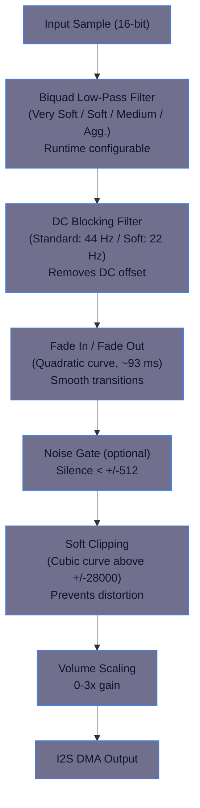
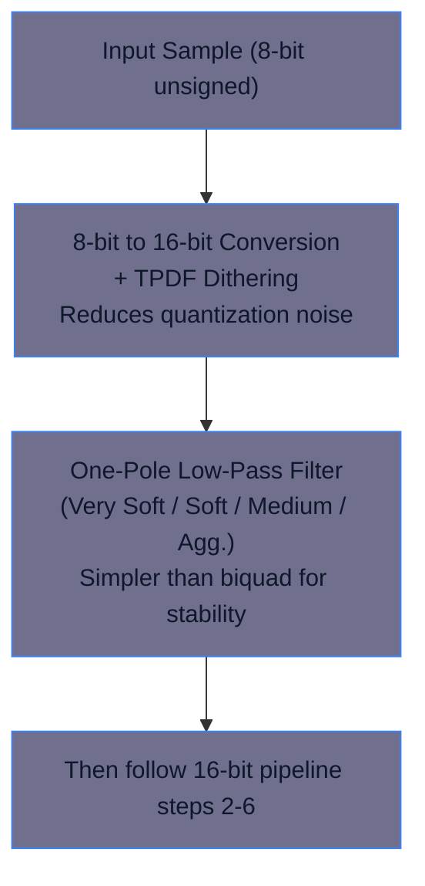

# Audio Engine - STM32 DSP Audio Playback System

[](LICENSE)
[](https://www.st.com/en/microcontrollers-microprocessors/stm32-32-bit-arm-cortex-mcus.html)
[]()
[](DOCUMENTATION_GUIDE.md)
[](API_REFERENCE.md)

A professional, reusable audio playback engine for STM32 microcontrollers with I2S support (including STM32G4, STM32F4, STM32H7 series and others) with runtime-configurable DSP filter chain, supporting 8-bit and 16-bit audio playback through I2S to digital amplifiers such as the MAX98357A. Includes an Air Effect high-shelf brightening filter with presets (+1, +2, +3 dB) and direct dB control.

> 📚 **New to the project?** See [DOCUMENTATION_GUIDE.md](DOCUMENTATION_GUIDE.md) for complete navigation of all 13 documentation files.

## 📋 Table of Contents

- [Features](#-features)
- [Quick Start](#-quick-start)
- [Filter Configuration](#-filter-configuration)
- [Filter Response Graphs](#-filter-response-graphs)
- [DSP Filter Chain](#-dsp-filter-chain)
- [Hardware Setup](#-hardware-setup)
- [API Reference](#-api-reference)
- [Performance](#-performance)
- [Documentation](#-documentation)

## ✨ Features

- **Dual Format Support**: 8-bit unsigned PCM and 16-bit signed PCM
- **Flexible Playback**: Mono and stereo modes
- **Runtime-Configurable DSP**: No recompilation needed for filter adjustments
- **No FPU Required**: All DSP operations use fixed-point integer math
- **DMA-Driven**: Efficient I2S streaming with double-buffering
- **Professional Filters**: Biquad LPF, DC blocking, soft clipping, fade in/out
- **Air Effect**: Tunable high-shelf brightening (presets: +1, +2, +3 dB and direct dB control)
- **Low Latency**: ~93 ms playback latency (2048-sample buffer @ 22 kHz)
- **Sample Rate Flexible**: Default 22 kHz, configurable up to 48 kHz

## What's New

- **Thread-Safe Stop Logic**: `StopPlayback()` refactored for complete thread-safety by moving all state modifications into the DMA callback context, eliminating race conditions.
- **Playback End Callback**: New weak `AudioEngine_OnPlaybackEnd()` callback for ISR-safe playback completion notifications - invoked exactly once per playback session with internal guard, ideal for event-driven applications, playlists, and RTOS integration.
- **DAC Power Control**: Added `SetDAC_Control()` and `GetDAC_Control()` for optional runtime control of DAC power management - useful when sharing the audio engine across multiple applications.
- **Flash Footprint**: `.text` ≈ 12.9 KB (Release build), reflecting added features and refactoring.
- **Non-Linear Volume Response**: Human-perception-matched volume control with configurable gamma curve. Enable via `VOLUME_RESPONSE_NONLINEAR` (#define in main.h). Gamma=2.0 provides intuitive volume feel.
- **Air Effect Auto-Control**: `SetAirEffectPresetDb()` now auto-enables/disables air effect based on preset (0 = off, >0 = on). No separate `SetAirEffectEnable()` call needed.
- **Air Effect**: High-shelf brightening with runtime control. Enable via `SetAirEffectPresetDb(preset)` and tune with `SetAirEffectGainDb()`.
- **Filter Warm-Up & Resets**: Introduced `WarmupBiquadFilter16Bit()` and consolidated resets via `RESET_ALL_FILTER_STATE()` to reduce startup transients and simplify `PlaySample()`.
- **Documentation**: Updated manual and README, enhanced graphs and A4 report, syntax-highlighted code blocks, and embedded system block diagram.
- **Examples Alignment**: Usage examples now match the current API and runtime configuration model.

## 🚀 Quick Start

### 1. Initialize Hardware Callbacks

```c
#include "audio_engine.h"

// Set up hardware interface callbacks (in main.c)
AudioEngine_DACSwitch = DAC_MasterSwitch;   // GPIO control for amplifier
AudioEngine_ReadVolume = ReadVolume;        // Volume level reading
AudioEngine_I2SInit = MX_I2S2_Init;         // I2S initialization

// Configure filters (optional - defaults are pre-set)
SetLpf16BitLevel(LPF_Soft);                 // Gentle 16-bit filtering
```

### 2. Play Audio

```c
// Play a 16-bit mono sample
extern const uint8_t doorbell_sound[];
extern const uint32_t doorbell_sound_samples;

PlaySample(
  doorbell_sound,          // Audio data pointer
  doorbell_sound_samples,  // Total samples (all channels combined)
  22000,                   // Sample rate (Hz)
  16,                      // Bit depth (8 or 16)
  Mode_mono                // Mono/Stereo
);

WaitForSampleEnd();          // Block until playback complete
```

### 3. Runtime Filter Adjustment

```c
FilterConfig_TypeDef cfg;
GetFilterConfig(&cfg);

cfg.enable_16bit_biquad_lpf = 1;      // Enable 16-bit LPF
cfg.enable_soft_clipping = 1;         // Enable soft clipping
cfg.lpf_16bit_level = LPF_Aggressive; // Strong filtering

SetFilterConfig(&cfg);
```

## 🎛️ Filter Configuration

### 16-bit Biquad LPF Aggressiveness Levels

The 16-bit path uses a **second-order biquad filter** where lower α values provide stronger filtering (same direction as the 8-bit one-pole architecture).

| Level | Alpha | Characteristics |
|-------|-------|------------------|
| **Very Soft** | 0.625 | Minimal filtering / brightest tone / highest cutoff |
| **Soft** | ~0.80 | Gentle filtering (recommended default) |
| **Medium** | 0.875 | Balanced filtering |
| **Firm** | ~0.92 | Firm filtering |
| **Aggressive** | ~0.97 | Strongest filtering / darkest tone / lowest cutoff |

**Recommended Input Levels:**

The biquad's feedback can cause overshoot. To avoid clipping:

| Filter Level | Recommended Input Range | Notes |
|--------------|-------------------------|-------|
| **Very Soft** | 75–85% of full scale (±24,500 to ±27,750) | Minimal overshoot |
| **Soft** | 70–80% of full scale (±22,937 to ±26,214) | **Recommended** |
| **Medium** | 70–75% of full scale (±22,937 to ±24,500) | Increasing feedback |
| **Firm** | 65–72% of full scale (±21,299 to ±23,592) | Higher feedback, more headroom needed |
| **Aggressive** | 60–70% of full scale (±19,660 to ±22,937) | Conservative headroom essential |

> **Tip**: Use **70–80% of full scale** as a safe starting point for most applications.

### 8-bit One-Pole LPF Aggressiveness Levels

The 8-bit path uses a **first-order one-pole filter** to avoid instability on quantized data. The alpha range is narrower than the 16-bit biquad.

| Level | Alpha | Cutoff Freq | Notes |
|-------|-------|-------------|-------|
| **Very Soft** | 0.9375 | ~3200 Hz | Minimal filtering |
| **Soft** | 0.875 | ~2800 Hz | Gentle filtering |
| **Medium** | 0.75 | ~2300 Hz | Balanced |
| **Firm** | 0.6875 | ~2000 Hz | Firm filtering |
| **Aggressive** | 0.625 | ~1800 Hz | Strong filtering |

**Why Different Ranges?**
- **16-bit biquad** (α: 0.625 → 0.97): Lower alpha = more filtering. Wider range safe for higher bit depth.
- **8-bit one-pole** (α: 0.625 → 0.9375): Higher alpha = more filtering. Narrower range prevents quantization noise amplification.

Both provide the same preset names (Very Soft, Soft, Medium, Aggressive) for consistency, but underlying coefficients differ due to architectural constraints. **Note:** The two filter types have opposite relationships between alpha and filtering strength.

### Warm-Up Behavior

**Problem**: Aggressive filtering can cause a brief "cracking" sound when the filter initializes from zero state.

**Solution**: The engine automatically runs **16 warm-up passes** (default, configurable via `BIQUAD_WARMUP_CYCLES` in `audio_engine.h`) when starting 16-bit playback with LPF enabled. This allows filter state to converge smoothly before DMA streaming begins, eliminating startup transients.

## 📊 Filter Response Graphs

Visual representations of the filter characteristics are available in the project:

### Generated Graphs
- [filter_characteristics_enhanced.png](filter_characteristics_enhanced.png) - Comprehensive filter analysis
- [Filter_Report_Enhanced.pdf](Filter_Report_Enhanced.pdf) - A4 technical report with all graphs and tables

### Generating Fresh Graphs

```bash
# Generate PNG visualization (outputs to Docs/)
python3 Docs/visualize_filters_enhanced.py

# Generate comprehensive PDF report (A4 format, outputs to Docs/)
python3 Docs/generate_filter_report_pdf.py
```

The PDF report includes:
- Frequency response plots for all filter levels
- Transfer function curves
- Phase response analysis
- Cutoff frequency tables
- Comprehensive technical specifications

## 🔊 DSP Filter Chain

### 16-bit Audio Processing Pipeline



### 8-bit Audio Processing Pipeline



## 🔧 Hardware Setup

### Pin Configuration Example (STM32G474)

Note: Pin assignments vary by STM32 model. Consult your device's datasheet for I2S pin locations.

| Function | Pin (Example) | Peripheral |
|----------|-----|------------|
| I2S Data Out | PB15 | I2S2_SD |
| I2S Clock | PB13 | I2S2_CK |
| I2S Word Select | PB12 | I2S2_WS |
| DAC Enable | GPIO | User-defined |
| Volume Control | GPIO | 2-bit selector |

### External Components

- **Digital Amplifier**: MAX98357A (I2S input)
- **Speaker**: 8Ω, 3W (or similar)
- **Power Supply**: 3.3V for STM32, 5V for amplifier

### DMA Configuration

- **DMA Channel**: DMA1 Channel 1
- **Mode**: Circular (ping-pong buffering)
- **Buffer Size**: 2048 samples (1024 samples per half-buffer)
- **Data Width**: 16-bit half-word

## 📚 API Reference

### Playback Control

```c
PB_StatusTypeDef PlaySample(
  const void *sample_to_play,     // Pointer to audio data
  uint32_t sample_set_sz,         // Total samples (all channels combined)
  uint32_t playback_speed,        // Sample rate (Hz)
  uint8_t sample_depth,           // 8 or 16 bits
  PB_ModeTypeDef mode             // Mode_mono / Mode_stereo
);

PB_StatusTypeDef WaitForSampleEnd(void);
PB_StatusTypeDef PausePlayback(void);
PB_StatusTypeDef ResumePlayback(void);
```

### Filter Configuration

```c
void SetFilterConfig(const FilterConfig_TypeDef *cfg);
void GetFilterConfig(FilterConfig_TypeDef *cfg);
void SetLpf16BitLevel(LPF_Level level);     // Very Soft / Soft / Medium / Aggressive
void SetLpfMakeupGain8Bit(float gain);      // 0.1 to 2.0
```

### FilterConfig Structure

```c
typedef struct {
  uint8_t enable_16bit_biquad_lpf;      // Enable 16-bit biquad LPF
  uint8_t enable_soft_dc_filter_16bit;  // Use soft DC filter (22 Hz vs 44 Hz)
  uint8_t enable_8bit_lpf;              // Enable 8-bit one-pole LPF
  uint8_t enable_noise_gate;            // Enable noise gate
  uint8_t enable_soft_clipping;         // Enable soft clipping
  uint32_t lpf_makeup_gain_q16;         // Q16 gain after 8-bit LPF
  LPF_Level lpf_16bit_level;            // Filter aggressiveness level
} FilterConfig_TypeDef;
```

### Air Effect (High-Shelf Brightening)

Optional treble boost above the cutoff (default α ≈ 0.75). Enable and tune at runtime:

```c
FilterConfig_TypeDef cfg;
GetFilterConfig(&cfg);
cfg.enable_air_effect = 1;            // Enable high-shelf brightening
SetFilterConfig(&cfg);

// Choose a preset or set dB directly
SetAirEffectPresetDb(2);              // +3 dB preset (presets: +1, +2, +3 dB)
// or
SetAirEffectGainDb(2.0f);             // +2 dB boost at ω=π
```

## ⚡ Performance

| Metric | Value |
|--------|-------|
| **CPU Usage** | ~15% @ 170 MHz (during playback, full filter chain) |
| **Latency** | ~93 ms total (~50 ms buffer + warm-up @ 22 kHz) |
| **Memory (RAM)** | ~4 KB (playback buffer size is set by macro in audio_engine.h) |
| **Memory (Flash)** | ≈12.9 KB (.text/.rodata, Release build) |
| **Max Sample Rate** | I2S can exceed 48 kHz; MAX98347A is limited to 96 kHz and higher rates are not recommended on embedded targets |
| **Typical Sample Rate** | 22 kHz (11 kHz Nyquist) |

## 📖 Documentation

### Comprehensive Documentation Suite

This project includes extensive documentation to help you understand and use the audio engine:

#### 📘 User Guides
- **README.md** (this file) - Quick start and overview
- [AUDIO_ENGINE_MANUAL.md](AUDIO_ENGINE_MANUAL.md) - Complete technical manual with architecture details
- [QUICK_REFERENCE.md](QUICK_REFERENCE.md) - Fast lookup guide for common tasks

#### 📗 API Documentation
- [API_REFERENCE.md](API_REFERENCE.md) - Comprehensive function reference with 40+ documented functions and code examples
- [HEADER_DOCUMENTATION.md](HEADER_DOCUMENTATION.md) - Guide to using the Doxygen-documented header file
- **audio_engine.h** - All public functions include Doxygen documentation for IDE integration

#### 📕 Technical Reports
- [Filter_Report_Enhanced.pdf](Filter_Report_Enhanced.pdf) - A4 technical report with filter response graphs and specifications
- [Audio_Engine_Manual.pdf](Audio_Engine_Manual.pdf) - PDF version of the complete manual
- [filter_characteristics_enhanced.png](filter_characteristics_enhanced.png) - Visual filter analysis

#### 📙 Air Effect Documentation
- [AIR_EFFECT_QUICK_REFERENCE.md](AIR_EFFECT_QUICK_REFERENCE.md) - High-shelf brightening filter guide
- [AIR_EFFECT_INTEGRATION.md](AIR_EFFECT_INTEGRATION.md) - Integration examples

### Using the Documentation

**New to the project?** See [DOCUMENTATION_GUIDE.md](DOCUMENTATION_GUIDE.md) for a complete guide to navigating all documentation.

1. **First-time users**: Start with this README, then read [AUDIO_ENGINE_MANUAL.md](AUDIO_ENGINE_MANUAL.md)
2. **Quick lookup**: Check [QUICK_REFERENCE.md](QUICK_REFERENCE.md) for common patterns
3. **Function search**: Use [FUNCTION_INDEX.md](FUNCTION_INDEX.md) to find functions alphabetically or by category
4. **API details**: See [API_REFERENCE.md](API_REFERENCE.md) for all 44+ functions with examples
5. **IDE integration**: Hover over function names in your editor to see Doxygen documentation from audio_engine.h
6. **Technical deep-dive**: Read the source code in `audio_engine.c` with inline comments

**📘 Documentation Navigation:** For help choosing which docs to read based on your needs, see [DOCUMENTATION_GUIDE.md](DOCUMENTATION_GUIDE.md)

### Included Files

- **README.md** (this file) - Quick start and overview
- [AUDIO_ENGINE_MANUAL.md](AUDIO_ENGINE_MANUAL.md) - Complete technical manual
- [Filter_Report_Enhanced.pdf](Filter_Report_Enhanced.pdf) - A4 technical report with graphs
- [filter_characteristics_enhanced.png](filter_characteristics_enhanced.png) - Visual filter analysis

### Key Configuration Defines

Located in `Core/Libraries/audio_engine.h`:

```c
#define BIQUAD_WARMUP_CYCLES  16        // Warm-up passes (default: 16)
#define FADEOUT_SAMPLES       2048U     // Fade-out length (~100 ms @ 22 kHz)
#define FADEIN_SAMPLES        2048U     // Fade-in length (~93 ms @ 22 kHz)
#define SOFT_DC_FILTER_ALPHA  65216     // Soft DC filter coefficient (0.995)
#define DC_FILTER_ALPHA       64225     // Standard DC filter coefficient (0.98)
#define NOISE_GATE_THRESHOLD  512       // Noise gate threshold (~1.5% full scale)
```

## 🎯 Usage Examples

### Example 1: Simple Doorbell Sound

```c
#include "audio_engine.h"
#include "doorbell_sound.h"

void play_doorbell(void) {
  SetLpf16BitLevel(LPF_Soft);
  
  PlaySample(doorbell_sound, DOORBELL_SIZE, 
         22000, 16, Mode_mono, LPF_Soft);
  
  WaitForSampleEnd();
}
```

### Example 2: High-Quality Music Playback

```c
void play_music_sample(void) {
  FilterConfig_TypeDef cfg;
  GetFilterConfig(&cfg);
  
  cfg.enable_16bit_biquad_lpf = 1;
  cfg.enable_soft_clipping = 1;
  cfg.enable_soft_dc_filter_16bit = 1;  // Preserve bass
  cfg.lpf_16bit_level = LPF_VerySoft;   // Minimal filtering
  
  SetFilterConfig(&cfg);
  
  PlaySample(music_data, MUSIC_SIZE,
         44100, 16, Mode_stereo, LPF_VerySoft);
  
  WaitForSampleEnd();
}
```

### Example 3: 8-bit Retro Sound Effect

```c
void play_retro_sfx(void) {
  FilterConfig_TypeDef cfg;
  GetFilterConfig(&cfg);
  
  cfg.enable_8bit_lpf = 1;
  cfg.enable_soft_clipping = 0;  // Keep retro edge
  
  SetLpfMakeupGain8Bit(1.2f);    // Boost slightly
  SetFilterConfig(&cfg);
  
  PlaySample(retro_sfx, SFX_SIZE,
         11025, 8, Mode_mono, LPF_Medium);
  
  WaitForSampleEnd();
}
```

## 🔍 Troubleshooting

### Audio Sounds Muffled
- **Cause**: Filter level too aggressive for sample content
- **Solution**: Use `SetLpf16BitLevel(LPF_VerySoft)` or `LPF_Soft`

### Clipping / Distortion
- **Cause**: Input samples exceed recommended range for filter level
- **Solution**: 
  - Reduce input amplitude to 70–80% of full scale
  - Enable soft clipping: `cfg.enable_soft_clipping = 1`

### Low Volume
- **Cause**: Makeup gain too low on 8-bit samples
- **Solution**: `SetLpfMakeupGain8Bit(1.5f)` (range: 0.1 to 2.0)

### Startup "Pop" Sound
- **Cause**: Biquad filter warm-up disabled or insufficient
- **Solution**: Ensure `BIQUAD_WARMUP_CYCLES` is set to 16 in `audio_engine.h`

### High-Frequency Noise
- **Cause**: Sample rate too low for content, or no LPF enabled
- **Solution**: Enable LPF and use appropriate aggressiveness level

## 📝 License

This project is provided under the MIT License. See LICENSE file for details.

## 🙏 Credits

- **Platform**: STMicroelectronics STM32 microcontrollers with I2S support
- **Digital Amplifier**: Maxim MAX98357A and compatible
- **DSP Algorithms**: Fixed-point biquad and one-pole IIR filters
- **Development**: VSCode + STM32CubeMX + ARM GCC

---

**Version**: 2.0  
**Last Updated**: January 2026  
**Maintainer**: Audio Engine Team

For detailed technical information, see [AUDIO_ENGINE_MANUAL.md](AUDIO_ENGINE_MANUAL.md).
